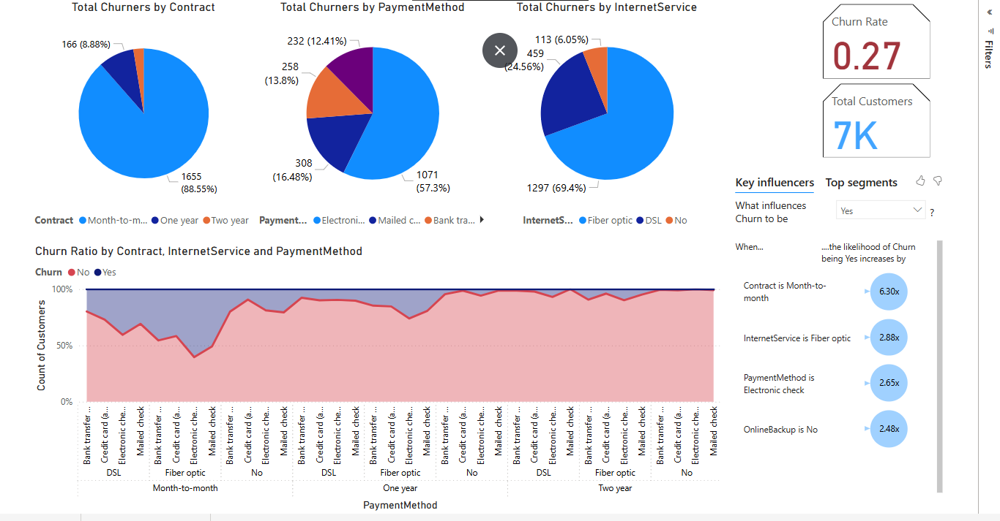
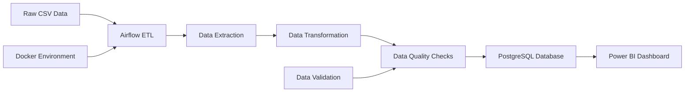

# Telco Customer Churn Analysis - ETL Pipeline & Power BI Dashboard

This project implements a complete ETL (Extract, Transform, Load) pipeline using Apache Airflow and PostgreSQL to analyze telecommunications customer churn patterns, with interactive visualizations created in Power BI.

## 🎯 Project Overview

**Objective**: Analyze customer churn patterns in a telecommunications company to identify key factors influencing customer retention and provide actionable insights for business strategy.

**Technology Stack**:
- **ETL Pipeline**: Apache Airflow + Docker
- **Database**: PostgreSQL
- **Data Processing**: Python (Pandas, SQLAlchemy)
- **Visualization**: Microsoft Power BI
- **Infrastructure**: Docker Compose

## 📊 Power BI Dashboard Results



## 🔍 Key Insights from Analysis

### Overall Churn Metrics
- **Total Customers**: 7,000
- **Overall Churn Rate**: 27% (1,869 customers)
- **Customer Retention Rate**: 73%

### 📈 Critical Findings

#### 1. **Contract Type is the Strongest Predictor**
- **Month-to-Month Contracts**: 88.55% of churned customers (1,655 customers)
- **One-Year Contracts**: 8.88% of churned customers (166 customers)  
- **Two-Year Contracts**: 2.57% of churned customers (48 customers)

**💡 Insight**: Customers on month-to-month contracts are **6.3x more likely to churn** than those with annual commitments.

#### 2. **Internet Service Impact**
- **Fiber Optic**: 69.4% of churners (1,297 customers)
- **DSL**: 24.56% of churners (459 customers)
- **No Internet**: 6.05% of churners (113 customers)

**💡 Insight**: Fiber optic customers show higher churn rates (**2.88x more likely**), suggesting potential service quality or pricing issues.

#### 3. **Payment Method Correlation**
- **Electronic Check**: 57.3% of churners (1,071 customers)
- **Mailed Check**: 16.48% of churners (308 customers)
- **Bank Transfer**: 13.8% of churners (258 customers)
- **Credit Card**: 12.41% of churners (232 customers)

**💡 Insight**: Electronic check users are **2.65x more likely to churn**, indicating potential friction in payment processing.

#### 4. **Service Backup Dependency**
- **No Online Backup**: Customers are **2.48x more likely to churn**

### 🎯 Business Recommendations

#### Immediate Actions (0-3 months)
1. **Contract Strategy**: 
   - Offer incentives for annual/bi-annual contract upgrades
   - Implement early renewal discounts for month-to-month customers

2. **Payment Experience**: 
   - Investigate electronic check payment friction
   - Promote automated payment methods with incentives

3. **Service Quality**: 
   - Review fiber optic service quality and pricing
   - Conduct customer satisfaction surveys for fiber customers

## 🏗️ ETL Pipeline Architecture



### Data Pipeline Features
- **Automated Daily Processing**: Scheduled ETL runs
- **Data Quality Validation**: Removes duplicates and null values
- **Tenure Grouping**: Categorizes customers by service length
- **Error Handling**: Comprehensive logging and alerting
- **Scalable Infrastructure**: Docker-based deployment

## 🚀 Quick Setup

### Prerequisites
- Docker Desktop
- Power BI Desktop
- Git

### Installation Steps

1. **Clone Repository**
```bash
git clone https://github.com/royalishere/Telco_ETL.git
cd ETL-TelCo
```

2. **Start PostgreSQL**
```bash
cd etl/
docker-compose up postgres -d
```

3. **Create Database**
```bash
docker-compose exec postgres psql -U airflow -d postgres -c "CREATE DATABASE telco_data;"
```

4. **Start Airflow**
```bash
docker-compose up -d
```

5. **Run ETL Pipeline**
- Access Airflow UI: http://localhost:8080
- Trigger `telco_etl` DAG

6. **Connect Power BI**
- Server: `localhost:5432`
- Database: `telco_data`
- Username: `airflow`
- Password: `airflow`
- Table: `telco_customers`

## 📁 Project Structure

```
ETL-TelCo/
├── etl/
│   ├── dags/                 # Airflow DAG definitions
│   ├── scripts/              # ETL processing scripts
│   ├── data/
│   │   ├── raw/             # Source CSV files
│   │   ├── clean/           # Processed data
│   │   └── quality_logs/    # Data quality reports
│   ├── config/              # Airflow configuration
│   └── docker-compose.yaml  # Infrastructure setup
├── visualization/           # Power BI files
└── README.md
```